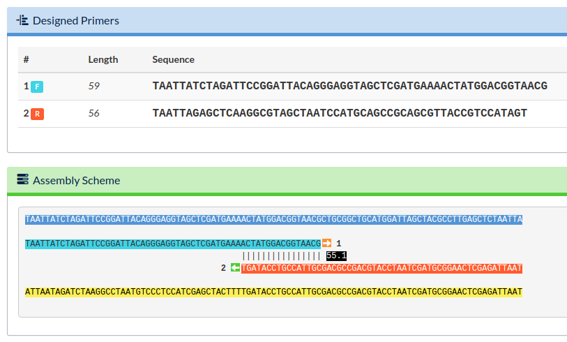
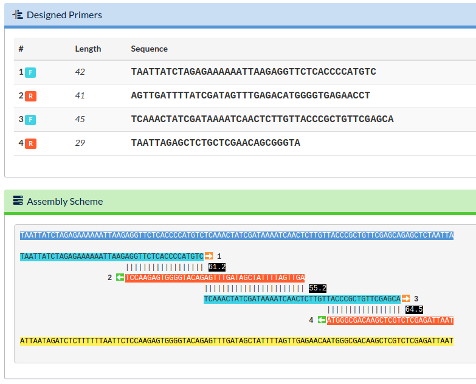

# PCR Assembly

Double stranded DNA \(dsDNA\) synthesis can be accomplished using oligonucleotides \(small single stranded DNA \(ssDNA\) fragments\) and methods such as Ligase Chain Reaction \(LCR\) or Polymerase Chain Reaction \(PCR\) \(also referred to as Polymerase Chain Assembly\). This is a cheaper alternative than ordering a dsDNA product from a gene synthesis company, such as IDT \(they refer to dsDNA products as `gblocks`\), when the final DNA product is between roughly 100 and 400 base pairs \(bp\). We have not used LCR synthesis and that protocol is described [elsewhere](https://openwetware.org/wiki/DNA_Synthesis_from_Oligos).

Let's say you have the following 99 bp dsDNA fragment that you need to construct:

```text
taattaTCTAGATTCCGGATTACAGGGAGGTAGCTCGatgaaaactatggacggtaacgctgcggctgcatggattagctacgccttGAGCTCtaatta
```

Synthesis of oligos is a fixed ~$0.19/bp for oligos up to length 60 bp, and then the price-per-base pair increases to ~$0.29/bp for oligos up to 90 bp, and then increases again to ~$0.49/bp for oligos up to 100 bp. The scaling of price for longer oligos is unfavorable! So you might have originally considered ordering two, complementary ssDNA oligos to then [anneal](anneal-oligos.md), but I urge you to reconsider! To significantly save money, you can do a PCR Assembly instead.

## Design Oligonucleotides

We recommend using an automated primer design tool. These tools will help select the best regions for hybridization of the primers to occur that minimizes the possibility of primers binding to incorrect strands, known as mis-priming. [Primerize](https://primerize.stanford.edu/) is a new lab favorite. The website is straight forward. Click on the big `Primerize!` button to get started. Enter in your DNA sequence and a name in the appropriate dialogue boxes. There are a few advanced options you can modify to the right. I like to reduce the minimum Tm to 55°C, and I deselect `check for T7 promoter`. Then click on `Primerize!` to run the job.

[](https://github.com/)

The output of our Primerize job. This is showing \(1\) the designed primers and \(2\) the assembly scheme or how they will anneal together during the PCR Assembly reaction.

Let's try another 99 bp dsDNA fragment for fun:

```text
taattaTCTAGAGAAAAAATTAAGAGGTTCTCACCCCatgtctcaaactatcgataaaatcaactcttgttacccgctgttcgagcaGAGCTCtaatta
```

If you run a `Primerize` job with the same settings as above you get the following result:

[](https://github.com/)

The output of our second Primerize job. In this example, we have four primers that would be ordered from IDT to construct our dsDNA product.

The reasons for why there are four oligos instead of two in the second example are complex, but the easiest explanation is that the region where two oligos would hybridize breaks one or more of the design rules. In fact for this construct it is impossible two use two oligos, because the region in the middle has too low of a melting temperature to be a hybridization region. Since the maximum oligo length is 60 bp, the maximum possible overlap would be 20 bp, and if you calculate the melting temperature for that region \(`tctcaaactatcgataaaat`\) with a program such as [OligoCalc](http://biotools.nubic.northwestern.edu/OligoCalc.html), the Tm ~= 43°C, which is significantly lower than our specified 55°C.

## Bulk Primerize Jobs

If you want to run `Primerize` jobs in bulk, you can use [PCR\_Assembly.py](https://github.com/hsalis/Private-Code/blob/master/DNAc/shared/PCR_Assembly.py) which wraps the `Primerize` subroutines. The `bulk_PCR_Assembly` function allows you to design sets of primers for as many dsDNA products as you can imagine! See the code for detailed notes on usage.

## Protocol

### Step 1: PCR Assembly Reaction

Combine the following reagents together in a PCR tube. Add ddH2O first and Taq DNA polymerase last. Transfer to the thermocycler and run the protocol as describe below.

| COMPONENT | 50 µL REACTION |
| --- | --- |
| ThermoPol Buffer \(10X\)\* | 5 µL |
| 10 mM dNTPs | 1 µL |
| 100 uM oligo | 5 µL/each |
| Taq DNA polymerase | 0.25 µL |
| ddH2O | to 50 µL |

| STEP | TEMPERATURE \(°C\) | TIME \(s\) |
| --- | --- | --- |
| Initial Denaturation | 95°C | 30 sec |
| \(1\) Denature | 95°C | 15-30 sec |
| \(2\) Anneal | 45-68°C \(Tm-5\) | 15-60 sec |
| \(3\) Extend | 68°C | 1 min/kb \(45 sec if &lt;1 kb\) |
| REPEAT \(1-3\) | 30 times | N/A |
| Final Extension | 68°C | 5 min |
| Hold | 4°C | Forever |

For details see [Taq DNA Polymerase with ThermoPol® Buffer \| NEB](https://www.neb.com/products/m0267-taq-dna-polymerase-with-thermopol-buffer) and [PCR Protocol for Taq DNA Polymerase with ThermoPol® Buffer - NEB](https://www.neb.com/protocols/1/01/01/taq-dna-polymerase-with-thermopol-buffer-m0267).

## Step 2: Gel electrophoresis

After finishing the reaction, use 5 µL of solution to run an analytical gel \(see [Gel Electrophoresis](https://github.com/reisalex/salis-lab-protocol-book/tree/453898c9360786eef221e6fffd8409c03a547e50/10_Test/gel_electro.md)\) to confirm that your product is correct. Combine 5 µL of each of the oligonucleotides as a control. The band of the PCR reaction product should run slower \(be longer\) than any of the oligonucleotides used to construct the product.

## Step 3: PCR Clean-Up

Do a [PCR Clean-Up](pcr-cleanup.md) on the reminaing 45 µL of product. For the elution step of the PCR clean-up, add 10-20 µL of ddH2O. Measure the concentration with the [NanoDrop](https://github.com/reisalex/salis-lab-protocol-book/tree/453898c9360786eef221e6fffd8409c03a547e50/13_Lab_Equipment/nanodrop.md). An ideal concentration would be at least 100 ng/µL for a product of length ~100 bp. If you are having difficulty with yield and efficiency of the PCR Assembly, you can consider doing multiple PCR Assemblies in parallel and then combine the products when you elute them. You can also do a rescue PCR using the first and last oligos from the assembly...

## Step 4: Rescue PCR

For a 4-part or greater PCR assembly, we recommend running a rescue [PCR](pcr.md).

