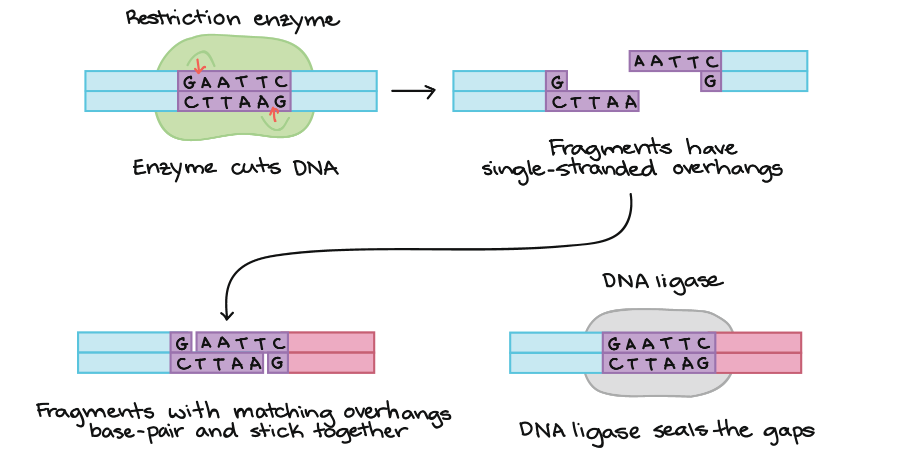

# Restriction enzyme digestion

Restriction enzymes are one of the oldest tools in the molecular cloning toolbox. We use restriction enzymes to "cut" DNA. Most restriction enzymes leave a small DNA overhang on one of the two strands, these overhangs are referred to as "sticky ends" \(**Figure 1**\). Complementary sticky ends can anneal, which can then be ligated together via a [ligase](ligation-with-t4-dna-ligase.md), resulting in the connecting of two separate DNA fragments. Some restriction enzymes leave "blunt ends" which have other uses as well \(**Figure 2**\).

**Figure 1**. "Cut-and-paste" cloning by restriction enzyme digest. Here, EcoRI is the restriction enzyme that recognizes the "G^AATTC" motif, and leaves a "AATT" 5'-overhang.

**Figure 2**. SmaI is a restriction enzyme from \_Serratia marcescens\_ that cuts at "CCC^GGG", leaving a blunt end with no overhangs.

## Double Digest

A double digest is a digestion reaction that uses two restriction enzymes. In most scenarios, you will do digestions with two restriction enzymes to create unique cut sites that can be used to ligate fragments together in a orientation specific way. Using the proper amounts of DNA, enzyme and buffer components in the correction reaction volume will allow you to achieve optimal digestion. By definition, 1 unit of restriction enzyme will completely digest 1 µg of substrate DNA in a 50 µL reaction in 60 minutes.

| COMPONENT | 10 µL REACTION | 50 µL REACTION |
| --- | --- | --- |
| DNA | 0.1 µg | 1 µg |
| 10X NEBuffer\* | 1 µL | 5 µL \(1X\) |
| Restriction enzymes | 1 unit \(0.2 µL\) | 10 units \(1 µL\) |
| ddH2O | to 10 µL | to 50 µL |

\*Check the enzyme-buffer compatability of the enzymes you wish to use. Use the appropratei buffer. Most enzymes in our lab will work best in NEB CutSmart buffer.

| STEP | TEMPERATURE \(°C\) | TIME \(hr\) |
| --- | --- | --- |
| Incubate | 37°C \(most restriction enzymes\) | 1 hour |

## Best Practices & Tips

* Keep enzymes on ice or in the Nalgene blocks when not in the freezer
* Enzymes should be the last component added to the reaction
* Mix components by pipetting the reaction mixture up and down, or by "flicking" the reaction tube. You can follow this with a quick \("touch"\) spin-down in a microcentrifuge. Do not vortex the reaction.
* The NEB protocol says to do a 1 hour digestion. Often times, our lab will run a 3 hour or 6 hour digest to drive the reaction to completion.
* Store all restriction enyzmes at -20°C unless stated otherwise. Buffers shouhld also be stored at -20°C.
* Consider running controls as reference!

Check out [Optimizing Restriction Endonuclease Reactions](https://www.neb.com/protocols/2012/12/07/optimizing-restriction-endonuclease-reactions) for more help.

